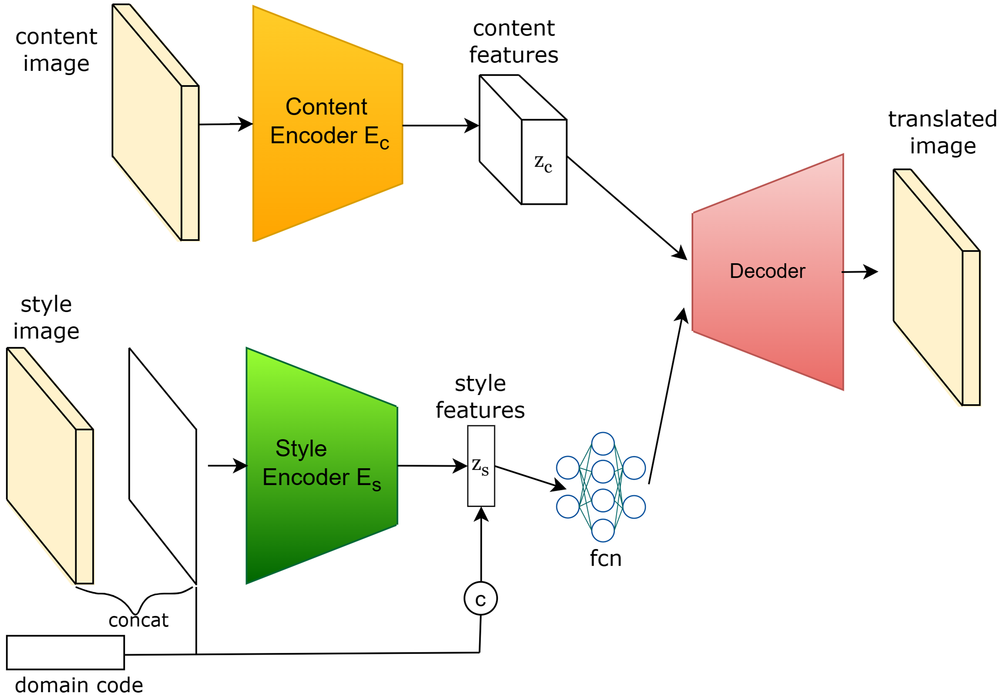
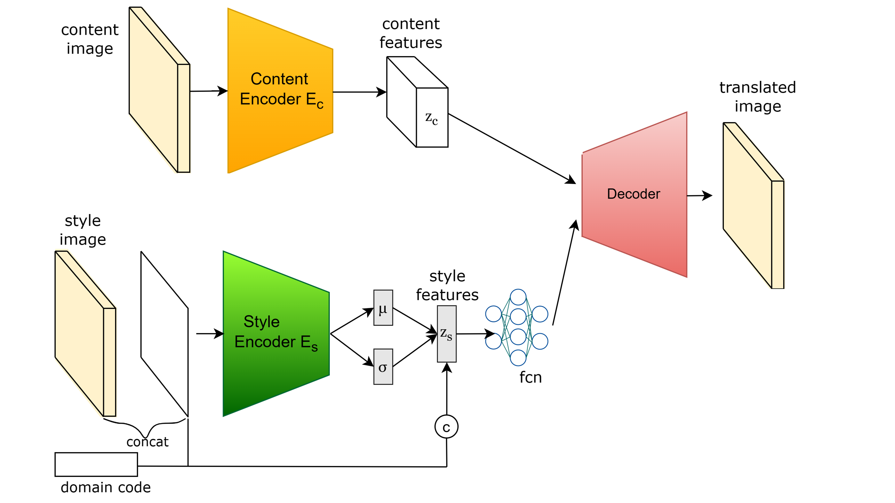

# NeutralTransformation

Weather-neutral image generation using deep learning.

This project provides two pretrained image-to-image translation models that transform weather-affected images into a weather-neutral representation while preserving scene content. The models were trained on the **Image2Weather dataset** and can be used as a preprocessing step for downstream computer vision tasks.

---

# Example Results

## Base Model

| Architecture                     | Result                           |
| -------------------------------- | -------------------------------- |
|  |  |

## Adaptive Instance Normalization (AdaIN) Model

| Architecture                      | Result                            |
| --------------------------------- | --------------------------------- |
|  |  |

---

# Model Overview

## Base Model

The Base Model uses a content encoder, style encoder, and decoder architecture. The content encoder extracts scene structure while the style encoder captures weather-related information. A decoder combines content and a target neutral style representation to generate a weather-neutral image.

## Adaptive Instance Normalization (AdaIN) Model

The AdaIN model extends the base architecture by applying Adaptive Instance Normalization during decoding. Instead of directly concatenating style information, AdaIN modulates feature statistics according to the target style representation, providing stronger control over the generated appearance.

---

## Weather Neutralization Strategy

The pretrained models were originally trained as conditional image-to-image translation networks using multiple weather domains. During inference, weather-neutral images are generated by combining the following inputs:

### Content Image

The input image is used as the **content image**. It provides the structural information of the scene, including roads, buildings, vehicles, pedestrians, and other objects that should be preserved in the output.

### Style Image

A simple neutral template image is used as the **style image**. Three templates are provided:

* `white`
* `black`
* `chequered`

These templates contain no weather-specific information and serve as neutral style references for the generator.

### Domain Vector

The models were trained using a conditional GAN framework in which each element of a one-hot vector represents a weather domain.

To generate a weather-neutral representation, a constant domain vector is used during inference. The implementation supports vectors consisting entirely of:

* `0`s
* `1`s

This removes the dependency on a specific weather domain and encourages the generator to produce a weather-invariant representation of the scene.

### Inference Pipeline

The weather-neutral image is generated as follows:

1. The original image is provided as the content image.
2. A neutral template (white, black, or chequered) is provided as the style image.
3. A constant domain vector is supplied to the conditional generator.
4. The generator combines content, style, and domain information to produce a weather-neutral output image while preserving scene structure.

This approach allows weather-specific visual characteristics to be suppressed while maintaining the semantic content required for downstream computer vision tasks.

# Impact on Object Detection

Weather conditions can significantly degrade the performance of computer vision systems. To evaluate the usefulness of weather-neutral image generation, object detection was performed on both the original rainy image and the generated weather-neutral images.


The figure shows that the object detector identifies a second pedestrian after weather neutralization, who was not identified in the original rainy image.

This demonstrates the potential of weather-neutral image generation as a preprocessing step for:

* Autonomous driving perception
* Outdoor robotics
* Visual surveillance systems

---

# Installation

Create a virtual environment:

```bash
python -m venv venv
```

Activate the environment:

### Windows PowerShell

```powershell
.\venv\Scripts\Activate.ps1
```

Install dependencies:

```bash
pip install -r requirements.txt
```

---

# Pretrained Weights

The model checkpoints are distributed separately through GitHub Releases.

Download the weights and place them in:

```text
weights/
├── base_model/
│   └── model_1000001.ckpt
└── adain_model/
    └── model_1000001.ckpt
```

---

# Repository Structure

```text
NeutralTransformation/
├── README.md
├── requirements.txt
├── .gitignore
├── src/
│   ├── transform2neutral.py
│   ├── dataset.py
│   ├── networks.py
│   ├── blocks.py
│   ├── functions.py
│   ├── misc.py
│   └── norm.py
├── assets/
│   └── neutral_templates/
│       ├── black.jpg
│       ├── chequered.jpg
│       └── white.jpg
├── docs/
│   └── images/
│       ├── base_config.png
│       ├── base_result.png
│       ├── adain_config.png
│       ├── adain_result.png
│       └── object_detection_comparison.png
```

---

# Usage

## Base Model

```bash
python src/transform2neutral.py \
    --root images \
    --neutral_template white \
    --target_path outputs \
    --model base_model \
    --weight_path weights/base_model/model_1000001.ckpt
```

## AdaIN Model

```bash
python src/transform2neutral.py \
    --root images \
    --neutral_template white \
    --target_path outputs \
    --model adain_model \
    --weight_path weights/adain_model/model_1000001.ckpt
```

---

# Command Line Arguments

| Argument             | Description                                                                                                            |
| -------------------- | ---------------------------------------------------------------------------------------------------------------------- |
| `--root`             | Path to the folder containing the input images. The path must point to a directory, not to a single image file.        |
| `--neutral_template` | Neutral template used for weather neutralization. Available options: `white`, `black`, `chequered`.                    |
| `--target_path`      | Output directory where generated images will be saved. The directory is created automatically if it does not exist.    |
| `--model`            | Model architecture to use. Available options: `base_model` and `adain_model`.                                          |
| `--weight_path`      | Path to the pretrained model checkpoint (`.ckpt`).                                                                     |
| `--batch_size`       | Number of images processed simultaneously. Default: `1`.                                                               |
| `--height`           | Output image height when resizing is enabled. Default: `720`.                                                          |
| `--width`            | Output image width when resizing is enabled. Default: `1280`.                                                          |
| `--keep_resolution`  | Preserve the original image resolution instead of resizing to `height × width`.                                        |
| `--device`           | Computation device. Available options: `auto`, `cpu`, or `cuda`. Default: `auto`.                                      |
| `--hot_vector`       | Domain vector used by the model. Can be `"ones"`, `"zeros"`, or a custom comma-separated vector such as `"0,1,0,0,0"`. |

## Input Directory Requirements

The `--root` argument must point to a folder containing images.

✅ Correct:

```bash
python src/transform2neutral.py \
    --root data/images \
    --neutral_template white \
    --target_path outputs \
    --model base_model \
    --weight_path weights/base_model/model_1000001.ckpt
```

```text
data/images/
├── img_0001.png
├── img_0002.png
├── img_0003.png
└── ...
```

❌ Incorrect:

```bash
python src/transform2neutral.py \
    --root data/images/img_0001.png \
    --neutral_template white \
    --target_path outputs \
    --model base_model \
    --weight_path weights/base_model/model_1000001.ckpt
```

The script expects a directory and will raise an error if a single image file is provided.

## Example: Fixed Resolution

```bash
python src/transform2neutral.py \
    --root images \
    --neutral_template white \
    --target_path outputs \
    --model base_model \
    --weight_path weights/base_model/model_1000001.ckpt \
    --height 720 \
    --width 1280
```

## Example: Preserve Original Resolution

```bash
python src/transform2neutral.py \
    --root images \
    --neutral_template white \
    --target_path outputs \
    --model adain_model \
    --weight_path weights/adain_model/model_1000001.ckpt \
    --keep_resolution
```

---

# Dataset

The models were trained using the **Image2Weather dataset**, which contains images captured under different weather conditions and enables learning weather-invariant visual representations.

---

# License

This project is distributed under the MIT License.
